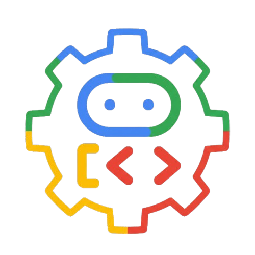

<div align="center">
  
</div>

<h3 align="center">ADK Agent Template</h3>

<div align="center">

[](pyproject.toml)
[](https://github.com/google/adk-python)
[](https://github.com/astral-sh/uv)
[](LICENSE)

</div>

---

<p align="center">
  Template for building Google ADK agents with a Workflow entry point, a separate services layer, and Docker support.
</p>

## 📝 Table of Contents

- [🧐 About](#about)
- [🏁 Getting Started](#getting-started)
  - [Prerequisites](#prerequisites)
  - [Installing](#installing)
  - [Running](#running)
- [🎈 Usage](#usage)
  - [Basic Agent Structure](#basic-agent-structure)
  - [Services Layer Pattern](#services-layer-pattern)
- [🔧 Running Tests](#tests)
- [🚀 Deployment](#deployment)
  - [Docker](#docker)
- [⛏️ Built Using](#built-using)
- [📚 Documentation](#documentation)
- [📄 License](#license)
- [Project Structure](#project-structure)

<a id="about"></a>

## 🧐 About

This template provides a foundation for building Google ADK (Agent Development Kit) agents. Calculator and time tools demonstrate how to separate business logic from ADK adapters, configure agents, and track execution through callbacks.

**Key Features:**

- ADK 2.6 `Workflow` root with an `LlmAgent` and custom tools
- Hexagonal architecture patterns with a framework-independent services layer
- Enum-based operation validation and structured tool errors
- Agent and tool lifecycle callbacks
- Jinja2 instruction templates and environment-driven configuration
- FastAPI application with the ADK development UI and a health endpoint
- Unit tests with coverage reporting and Ruff quality checks
- Multi-stage Docker image running as a non-root user

<a id="getting-started"></a>

## 🏁 Getting Started

### Prerequisites

- Python 3.12+
- [uv package manager](https://github.com/astral-sh/uv)
- [Just command runner](https://github.com/casey/just) for the `just` commands below
- Google Cloud project with Vertex AI enabled and permission to invoke the configured model
- [Google Cloud CLI](https://cloud.google.com/sdk/docs/install) for local authentication
- Docker for container builds and execution

### Installing

From the repository root:

```bash
# Install dependencies, including development tools
just install

# Configure environment
cp .env.example .env
# Edit .env with your Google Cloud project details
```

Alternatively, install dependencies with `uv sync`.

Required environment variables:

```dotenv
GOOGLE_GENAI_USE_VERTEXAI=true
GOOGLE_CLOUD_PROJECT=your-gcp-project
GOOGLE_CLOUD_LOCATION=europe-west1
```

Optional settings include `AGENT_NAME`, `MODEL` (defaults to `gemini-2.5-flash`), and `LOG_LEVEL`. See [.env.example](.env.example) for the configuration template and [settings.py](src/app/config/settings.py) for defaults.

Configure [Application Default Credentials (ADC)](https://cloud.google.com/docs/authentication/set-up-adc-local-dev-environment) for local Vertex AI calls:

```bash
gcloud auth application-default login
```

### Running

```bash
just api
```

Or run Uvicorn directly from `src/`:

```bash
cd src
uv run uvicorn app.main:app --reload --host 127.0.0.1 --port 8000
```

Access the application:

- Web UI: [http://localhost:8000/dev-ui/](http://localhost:8000/dev-ui/)
- API docs: [http://localhost:8000/docs](http://localhost:8000/docs)
- Health: [http://localhost:8000/health](http://localhost:8000/health)

Select `root` in the ADK UI and try a prompt such as `Calculate 12 multiplied by 7` or `What time is it in Europe/Paris?`.

<a id="usage"></a>

## 🎈 Usage

### Basic Agent Structure

The entry point in [agent.py](src/app/components/agents/root/agent.py) exports `root_agent` as an ADK `Workflow`. Its first node is the assistant agent:

```python
from google.adk import Workflow
from google.adk.agents import LlmAgent

from app.components.callbacks.after_agent import log_agent_end
from app.components.callbacks.before_agent import log_agent_start
from app.components.callbacks.tool_callbacks import log_after_tool, log_before_tool
from app.components.tools.custom.example_tool import (
    calculate_tool,
    get_current_time_tool,
)
from app.config.constants import SINGLE_AGENT_DESCRIPTION, SINGLE_AGENT_INSTRUCTION
from app.config.settings import settings

assistant_agent = LlmAgent(
    name=settings.AGENT_NAME,
    model=settings.MODEL,
    mode="single_turn",
    description=SINGLE_AGENT_DESCRIPTION,
    instruction=SINGLE_AGENT_INSTRUCTION,
    tools=[calculate_tool, get_current_time_tool],
    before_agent_callback=log_agent_start,
    after_agent_callback=log_agent_end,
    before_tool_callback=log_before_tool,
    after_tool_callback=log_after_tool,
)

root_agent = Workflow(
    name=settings.AGENT_NAME,
    edges=[("START", assistant_agent)],
)
```

Keep the exported variable named `root_agent` so ADK can discover it. Add workflow nodes and edges here as the application grows. Edit [agent_instruction.j2](src/app/instructions/templates/agent_instruction.j2) to customize the assistant's instructions.

### Services Layer Pattern

Business logic lives in `services/` and can be called independently of ADK:

```python
from app.services.calculator_service import Operation, calculator_client

result = calculator_client.calculate(Operation.ADD, 5, 3)
assert result["result"] == 8
```

The ADK adapter validates the operation and wraps service errors before exposing the function as a tool:

```python
from google.adk.tools import ToolContext
from google.adk.tools.function_tool import FunctionTool

from app.services.calculator_service import Operation, calculator_client
from app.utils.error import ToolExecutionError


def calculate(
    operation: Operation,
    a: float,
    b: float,
    tool_context: ToolContext,
) -> dict:
    try:
        operation_enum = Operation(operation)
        return calculator_client.calculate(operation_enum, a, b)
    except ValueError as exc:
        raise ToolExecutionError(
            message=str(exc),
            details={"operation": operation, "a": a, "b": b},
        ) from exc


calculate_tool = FunctionTool(func=calculate)
```

See [SERVICES_VS_TOOLS.md](docs/SERVICES_VS_TOOLS.md) for the pattern and [example_tool.py](src/app/components/tools/custom/example_tool.py) for the complete adapters.

<a id="tests"></a>

## 🔧 Running Tests

Run these commands from the repository root:

```bash
# Run the test suite with coverage
just test

# Or use uv directly
uv run pytest --cov=app --cov-report=term-missing
```

Tests cover services, tools, agent configuration, callbacks, instruction loading, and error handling. The test command reports the current test count and coverage.

Other development commands:

| Command | Description |
| --- | --- |
| `just format` | Format Python code with Ruff |
| `just sort-imports` | Sort Python imports with Ruff |
| `just lint` | Run Ruff checks |
| `just pre-commit` | Format, lint, and run tests |

<a id="deployment"></a>

## 🚀 Deployment

### Docker

Build the image from the repository root:

```bash
docker build -t adk-agent-template .
```

For local execution on macOS or Linux, pass the environment configuration and mount the ADC file created during setup:

```bash
docker run --rm -p 127.0.0.1:8000:8000 \
  --env-file .env \
  -e GOOGLE_APPLICATION_CREDENTIALS=/tmp/adc.json \
  --mount "type=bind,source=${HOME}/.config/gcloud/application_default_credentials.json,target=/tmp/adc.json,readonly" \
  adk-agent-template
```

Adjust the source path if your Google Cloud CLI configuration directory differs from the default. The mounted file must be readable by the container's `app` user (UID 1000).

The default entry point runs Gunicorn with one Uvicorn worker. Append `local` after the image name to use Uvicorn with hot reload. The image checks `/health` to monitor application availability.

For Google Cloud deployment, configure [ADC for the runtime environment](https://cloud.google.com/docs/authentication/provide-credentials-adc), such as an attached service account with Vertex AI access.

<a id="built-using"></a>

## ⛏️ Built Using

- [Google ADK](https://github.com/google/adk-python) — Agent Development Kit
- [FastAPI](https://fastapi.tiangolo.com/) — Web framework
- [Pydantic](https://pydantic.dev/) — Data validation and settings
- [Jinja2](https://jinja.palletsprojects.com/) — Instruction templates
- [Uvicorn](https://www.uvicorn.org/) and [Gunicorn](https://gunicorn.org/) — Application servers
- [Pytest](https://pytest.org/) — Testing framework
- [Ruff](https://docs.astral.sh/ruff/) — Linting and formatting
- [uv](https://github.com/astral-sh/uv) — Dependency management

<a id="documentation"></a>

## 📚 Documentation

- [ARCHITECTURE.md](docs/ARCHITECTURE.md) — Architecture decisions and patterns
- [SERVICES_VS_TOOLS.md](docs/SERVICES_VS_TOOLS.md) — Services and ADK adapters
- [TOOL_GUIDELINES.md](docs/TOOL_GUIDELINES.md) — MCP vs custom tools guide
- [CONTRIBUTING.md](CONTRIBUTING.md) — Development workflow and contribution guidelines

<a id="license"></a>

## 📄 License

This project is licensed under the [Apache License 2.0](LICENSE).

## Project Structure

```text
src/
├── app/
│   ├── components/
│   │   ├── agents/root/  # Workflow and assistant agent
│   │   ├── tools/        # Custom tools and MCP extension point
│   │   ├── callbacks/    # Agent and tool lifecycle hooks
│   │   └── plugins/      # Plugin extension point
│   ├── services/        # Business logic independent of ADK
│   ├── config/          # Settings and constants
│   ├── instructions/    # Jinja2 templates and loader
│   ├── routes/          # Custom route extension point
│   ├── middleware/      # Middleware extension point
│   ├── models/          # Data model extension point
│   ├── utils/           # Error handling and logging
│   ├── application.py   # FastAPI application factory
│   └── main.py          # Application entry point
├── test/unit/           # Unit tests
└── logging.conf         # Server logging configuration
```
